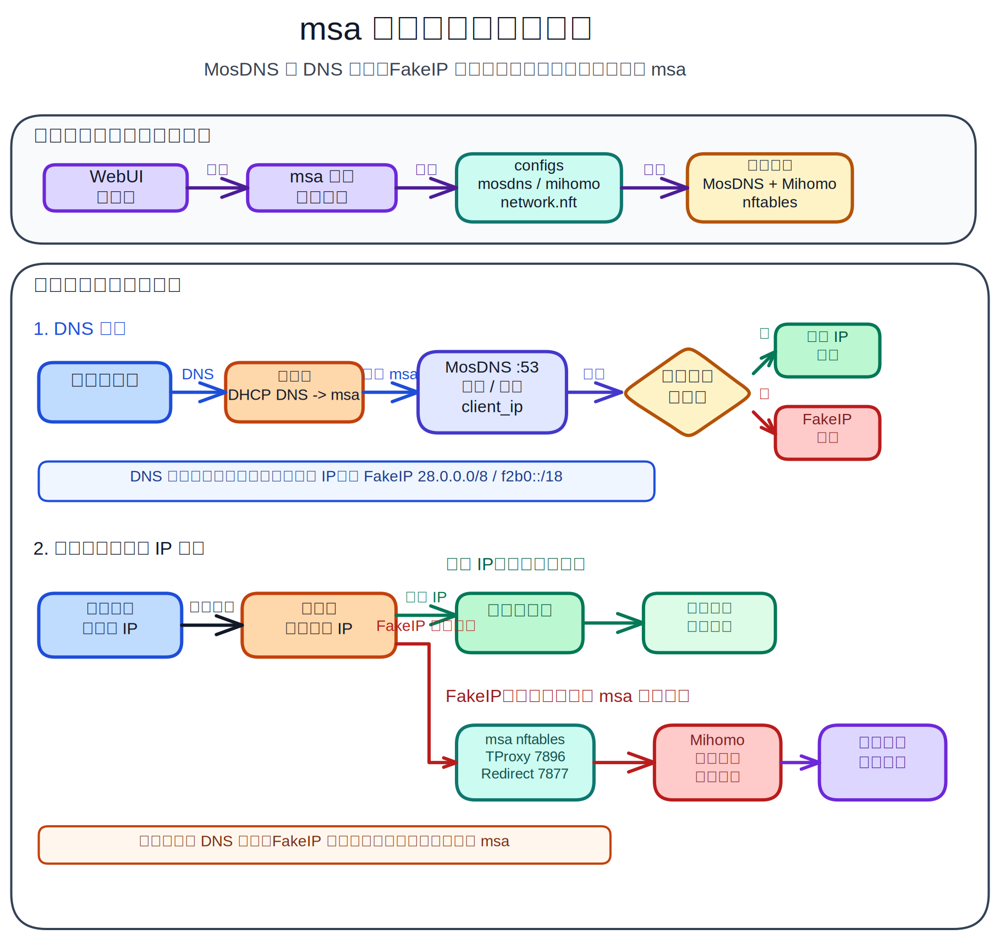

# msa

<p align="center">
  
</p>

[English README](README.en.md)

[甯歌闂 FAQ](docs/faq.md)

`msa` 鏄竴涓潰鍚?MosDNS + Mihomo 宸ヤ綔娴佺殑 MSM 椋庢牸绠＄悊闈㈡澘閲嶆瀯鐗堛€傞」鐩洰鏍囨槸鎻愪緵鍙嚜閮ㄧ讲銆佸彲瀹¤鐨?DNS 鍒嗘祦銆侀€忔槑浠ｇ悊銆丮ihomo 绠＄悊鍜屽骞冲彴瀹夎浣撻獙銆?
褰撳墠鍙戝竷鐗堟湰锛歚v0.4.2.0`

> **鎻愮ず锛欳loudflare Redirect CLI 鎻掍欢涓烘祴璇曞姛鑳姐€?* 瀹冪敤浜庤鈥滀笉璧颁唬鐞嗙殑瀹㈡埛绔€濊闂敤鎴锋寚瀹氱殑 Cloudflare 鐩剧珯鏃讹紝杩斿洖鏈満缃戠粶瀹炴祴杈冨揩鐨?Cloudflare CDN IPv4/IPv6銆傝鍔熻兘渚濊禆鏈満缃戠粶銆佽繍钀ュ晢璺敱銆丆loudflare Anycast銆佸煙鍚嶅悕鍗曡川閲忓拰 MosDNS 褰撳墠閰嶇疆锛屼笉淇濊瘉涓€瀹氭瘮鍘熻В鏋愭洿蹇垨鏇寸ǔ瀹氥€傝缁嗙敤娉曡 [Cloudflare Redirect 鏂囨。](docs/plugins/cloudflare-redirect.md)銆?
## 鍔熻兘姒傝

- 鍘熺増 MSM 椋庢牸 6 姝ュ垵濮嬪寲鍚戝锛岃鐩栫鐞嗗憳璐﹀彿銆佺郴缁熷弬鏁般€丏NS銆両Pv6銆丗ake-IP銆侀€忔槑浠ｇ悊鍜岀粍浠跺畨瑁呴厤缃€?- MosDNS + Mihomo 榛樿缁勫悎锛屾寜 mssb 椋庢牸鐢熸垚鍥藉唴澶栧垎娴侀摼璺細MosDNS `:53` 鍏ュ彛锛孧ihomo DNS `:6666`锛孎ake-IP `28.0.0.0/8`锛孴Proxy `7896`锛孯edirect `7877`銆?- 鏀寔鏈哄満璁㈤槄銆佹墜鍔ㄨ妭鐐广€丮osDNS 瀹㈡埛绔唬鐞嗘ā寮忋€丮ihomo 鑺傜偣/瑙勫垯/杩炴帴/鏃ュ織/閰嶇疆椤甸潰銆?- 鏀寔 Mihomo 鑷畾涔夐厤缃€丆odeMirror YAML 缂栬緫鍣ㄣ€佺粍浠舵洿鏂版鏌ャ€佽嚜鍔ㄤ笅杞姐€佹洿鏂伴€氱煡鍜屽崌绾ф柟寮忛厤缃€?- 鏀寔 MosDNS銆丮ihomo銆乑ashboard 鏈湴涓婁紶瀹夎锛岀綉缁滃洶闅炬椂鍙敤棰勪笅杞芥牳蹇冪绾垮畨瑁呫€?- 鏀寔 Linux tarball/systemd銆乫nOS FPK銆乁nraid PLG锛汥ocker TUN host/macvlan 褰撳墠涓哄疄楠岄儴缃层€?- Docker 閮ㄧ讲蹇呴』鎶婂涓绘満鏁版嵁鐩綍鏄犲皠鍒板鍣?`/opt/msa`锛岄粯璁ょず渚嬩娇鐢?`./msa-data:/opt/msa`銆?
## 鏋舵瀯鍘熺悊鍥?
<p align="center">
  
</p>

## 骞冲彴鏀寔

| 骞冲彴 | 鐘舵€?| 瀹夎鏂囨。 | 鏇存柊/鍗歌浇鏂瑰紡 |
|---|---|---|---|
| Linux tarball/systemd | 绋冲畾鏀寔 | [Linux 瀹夎](docs/install/linux.md) | `msa update` / `msa uninstall` |
| fnOS FPK | 鏀寔 | [fnOS FPK 瀹夎](docs/install/fnos-fpk.md) | fnOS / 椋炵墰搴旂敤涓績鎴?FPK 鍖呯鐞嗗櫒 |
| Unraid PLG | 绋冲畾鏀寔 | [Unraid PLG 瀹夎](docs/install/unraid-plg.md) | Unraid 鎻掍欢绠＄悊椤甸潰 |
| Docker TUN host/macvlan | 瀹為獙鎬э紝鏈畬鍏ㄥ畬鎴?| [Docker 瀹為獙閮ㄧ讲](docs/docker.md) | Docker / Compose / 瀹瑰櫒绠＄悊鍣?|

`msa update` 鍜?`msa uninstall` 鍙潰鍚?Linux tarball/systemd 瀹夎銆俧nOS FPK銆乁nraid PLG銆丏ocker 璇烽€氳繃鍚勮嚜骞冲彴绠＄悊鍣ㄦ洿鏂版垨鍗歌浇锛岄伩鍏嶇粫杩囧寘鐘舵€併€?
## 涓嬭浇

GitHub Release锛?
```text
https://github.com/leafss1022/msa/releases/tag/v0.4.2.0
```

| 璧勪骇 | 涓嬭浇鍦板潃 |
|---|---|
| Linux x86_64 | `https://github.com/leafss1022/msa/releases/download/v0.4.2.0/msa-linux-amd64.tar.gz` |
| Linux ARM64 | `https://github.com/leafss1022/msa/releases/download/v0.4.2.0/msa-linux-arm64.tar.gz` |
| fnOS x86 FPK | `https://github.com/leafss1022/msa/releases/download/v0.4.2.0/msa_0.4.2.0_x86.fpk` |
| fnOS ARM FPK | `https://github.com/leafss1022/msa/releases/download/v0.4.2.0/msa_0.4.2.0_arm.fpk` |
| Unraid PLG | `https://github.com/leafss1022/msa/releases/download/v0.4.2.0/msa.plg` |

## 蹇€熷紑濮?
1. 鎸変綘鐨勮繍琛屽钩鍙伴€夋嫨瀹夎鏂囨。锛歀inux銆乫nOS銆乁nraid 鎴?Docker銆?2. 瀹夎鍚庢墦寮€ WebUI锛岄粯璁ゅ湴鍧€鏄?`http://<鏈嶅姟鍣↖P>:7777`銆?3. 瀹屾垚鍒濆鍖栧悜瀵笺€傞娆″垵濮嬪寲浼氬啓鍏ョ郴缁熼厤缃€佺敓鎴?MosDNS/Mihomo 閰嶇疆锛屽苟淇濆瓨鍒版暟鎹簱銆?4. 鍦ㄤ富璺敱涓婇厤缃?DHCP DNS 鍜?FakeIP 闈欐€佽矾鐢憋紝璁╁眬鍩熺綉瀹㈡埛绔祦閲忚繘鍏?msa銆?
璺敱鍣ㄦ帴鍏ユ暀绋嬶細

- [璺敱鍣ㄦ帴鍏ユ€昏](docs/guide/zh/router-integration.md)
- [RouterOS锛圡ikroTik锛塢(docs/guide/zh/routeros.md)
- [鐖卞揩 iKuai](docs/guide/zh/ikuai.md)
- [OpenWrt](docs/guide/zh/openwrt.md)
- [UniFi锛圲biquiti锛塢(docs/guide/zh/unifi.md)

杩愯鐩綍銆佺鍙ｅ拰鏂囦欢缁撴瀯瑙?[杩愯鍙傝€僝(docs/reference/runtime.md)銆?
## 鎻掍欢鏂囨。

- [Cloudflare Redirect CLI 鎻掍欢](docs/plugins/cloudflare-redirect.md)锛氫负鈥滀笉璧颁唬鐞嗙殑瀹㈡埛绔€濇妸鎸囧畾 Cloudflare 鐩剧珯閲嶅畾鍚戝埌鏈満瀹炴祴杈冨揩鐨?Cloudflare CDN IPv4/IPv6銆?
## 寮€鍙戜笌鍙戝竷

鏈湴杩愯锛?
```bash
go run ./cmd/msa serve -c ./data -p 7777
```

鍙戝竷鎵撳寘娴佺▼瑙?[RELEASING.md](RELEASING.md)銆俇nraid 鎵撳寘寮€鍙戣鏄庤 [packaging/unraid/README.md](packaging/unraid/README.md)銆?
## 璇存槑

`msa` 涓嶅寘鍚?MSM 鐨勯棴婧愬悗绔唬鐮併€傞」鐩洰鏍囨槸鍋氫竴涓潪鍟嗕笟鐢ㄩ€旂殑寮€鏀鹃噸鏋勭増锛氬瑙傚拰浣跨敤浣撻獙鍙傝€?MSM锛屽悗绔涓哄洿缁?mssb 椋庢牸鐨?MosDNS + Mihomo 宸ヤ綔娴侀噸鏂板疄鐜般€?
## 楦ｈ阿

鎰熻阿杩欎簺椤圭洰鎻愪緵鍙傝€冿細

- [`msm9527/msm-wiki`](https://github.com/msm9527/msm-wiki)锛氫綔涓?MSM 绠＄悊浣撻獙鍜屽姛鑳界粍缁囩殑鍏紑鍙傝€冦€?- [`baozaodetudou/mssb`](https://github.com/baozaodetudou/mssb)锛氫綔涓?MosDNS + Mihomo 鍚庣宸ヤ綔娴佺殑鍏紑鍙傝€冦€?- [Gzh256](https://github.com/Gzh256)锛氭劅璋㈠崗鍔╂祴璇曞拰楠岃瘉澶氫釜鐗堟湰銆?
鏈」鐩笌 MSM銆乵ssb 涓婃父椤圭洰娌℃湁闅跺睘鍏崇郴銆?
[](https://linux.do/)
